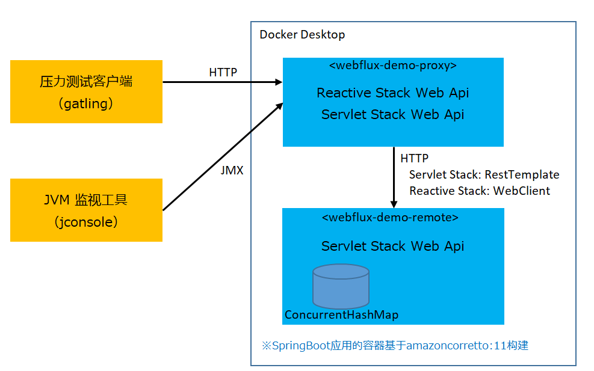
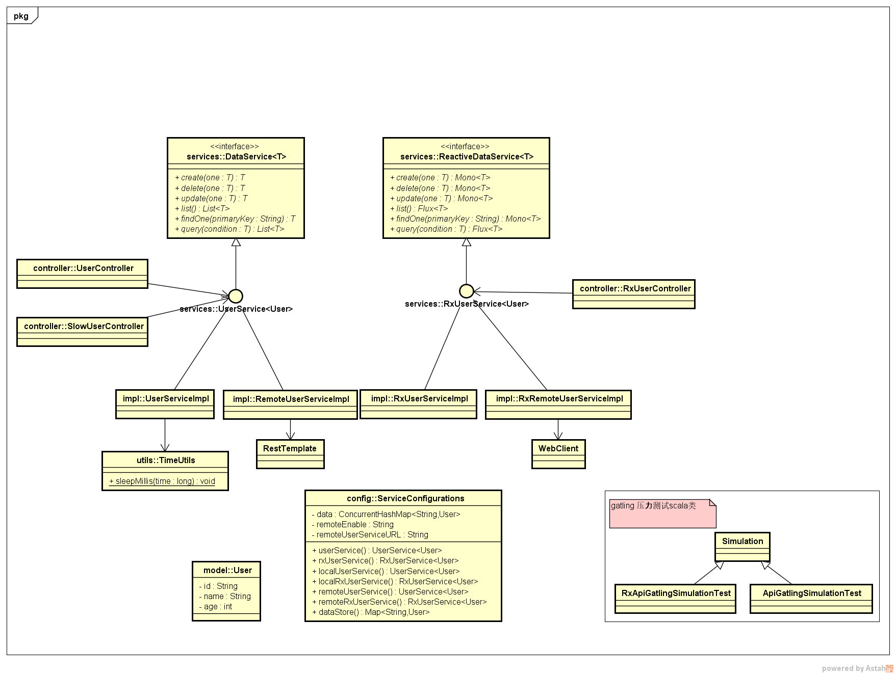
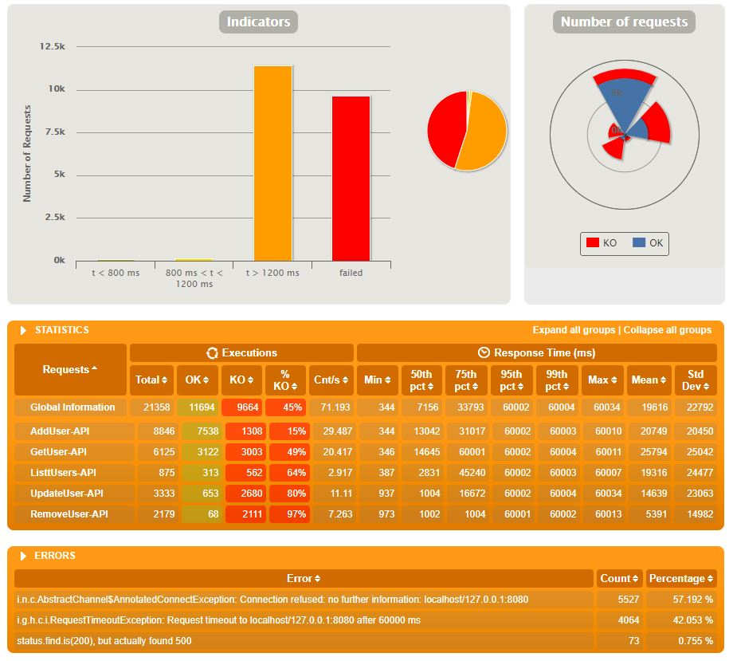
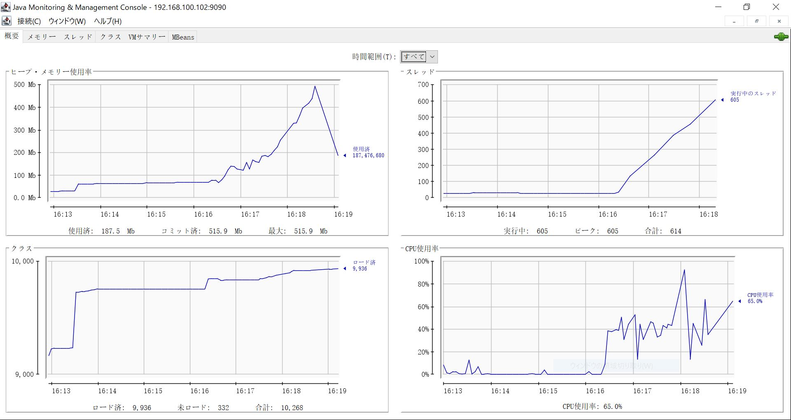
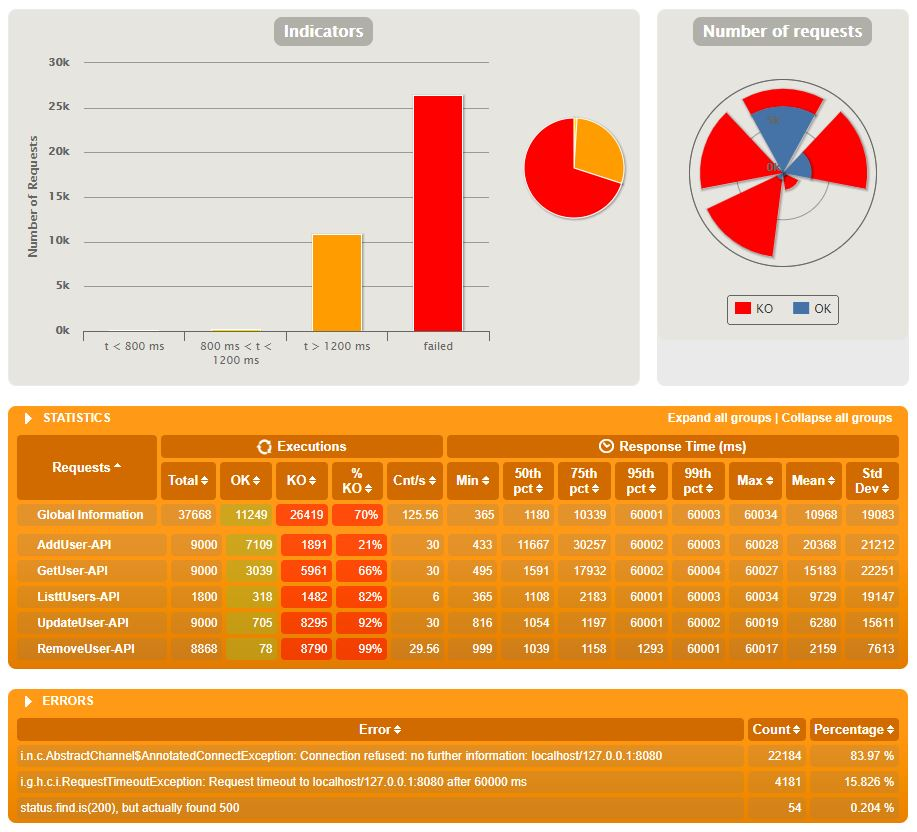
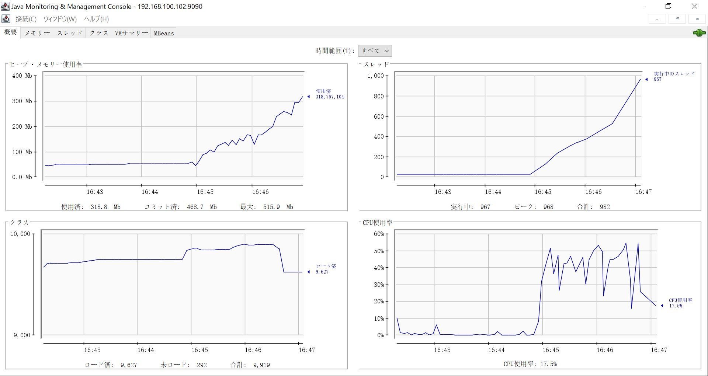
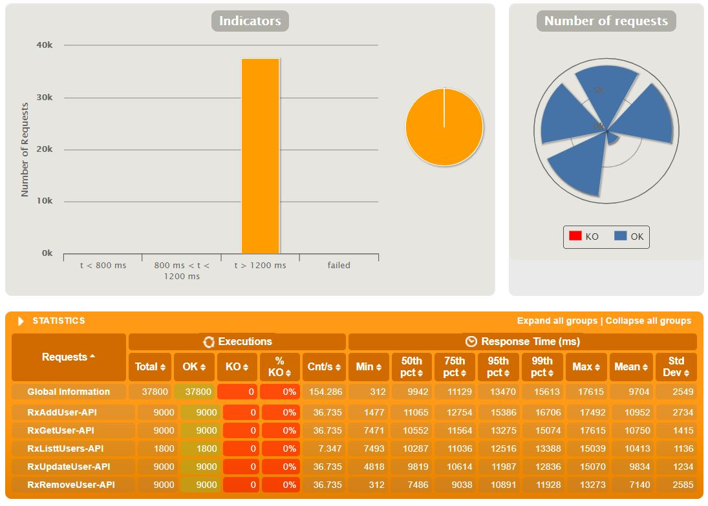
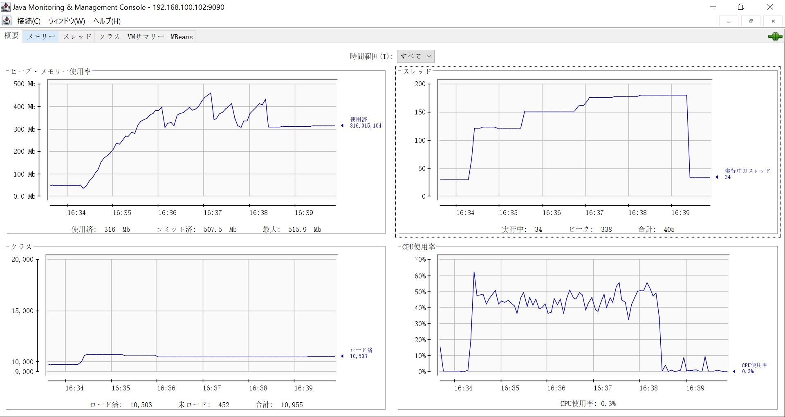

# Spring Boot WebFlux 开发体验 & Spring MVC 压力测试比较

## Servlet Stack Web Application 存在的问题  
一个请求需要一个线程处理。在请求的处理结束之前，线程一直被占用，即使处理因为阻塞而等待，也不会释放线程。
网络IO、外部服务调用、数据库访问等典型的阻塞处理时，假如需要从慢速的网络缓慢地read数据，这样会一直低效的占用着线程。
这样一来，面对大量的请求就需要的同样大量的线程来处理。
线程的生成，本身也是需要消耗内存资源的（最起码需要保障每个线程的堆栈空间）。
另外，CPU在切换线程时，也需要进行上下文切换。

## Spring WebFlux  
基于Reactor 库（[Reactor官网](https://projectreactor.io/)），对REST API、服务器推送事件（Server-Sent Events，SSE）、WebSocket 提供了支持。并且也提供了反应式客户端（WebClient）。

## 技术体验的目标  
1. 对相同功能的Spring MVC和Spring WebFlux 进行压力测试，体会两者间的差异。
2. 基于Spring WebFlux 开发Reactive应用，体验Reactive Programming。 

本次技术体验的整体构成图：  


> 因为时间有限，所有的代码都在同一个Spring Boot工程中实现（包括压力测试客户端的scala代码）。

代码实现的结构如下图：  


## 运行环境构建
1. Build Spring Boot application
    ```
    ./gradlew build
    ```

2. Build docker image
    - 构建SpringBoot运行的基础Image
        ```
        docker build -f ./docker/springboot -t springboot .
        ```
    - 构建webflux-demo-remoted
        ```
        docker build -f ./Dockerfile-remote -t webflux-demo-remote .
        ```
    - 构建webflux-demo-proxy
        ```
        docker build -f ./Dockerfile-proxy -t webflux-demo-proxy .
        ```
3. Run docker container
    - 创建docker内部网络
        ```
        docker network create -d bridge tokyobs
        ```
    - 运行webflux-demo-remote
        ```
        docker run --name=webflux-demo-remote --network=tokyobs -d -p 8090:8090 webflux-demo-remote
        ```
    - 运行webflux-demo-proxy
        ```
        docker run --name=webflux-demo-proxy --network=tokyobs -d -p 8080:8080 -p 9090:9090 webflux-demo-proxy
        ```
        >9090 是JMX访问用的端口

## 如果直接使用Gradle启动SpringBoot的话
1. 启动webflux-demo-remote
    ```
    gradlew bootRun -Pargs="--server.port=8090"
     ```
2. 启动webflux-demo-proxy
    ```
    gradlew bootRun -Pargs="--server.port=8080,--services.user.remote.enable=1"
    ```

## 性能测试工具gatling
1. 运行测试程序
    - 运行全部的测试用例
        ```
        ./gradlew gatlingRun
        ```
    - 指定运行Servlet Stack Api的测试用例
        ```
        ./gradlew gatlingRun-ApiGatlingSimulationTest
        ```
    - 指定运行Reactive Stack Api的测试用例
        ```
        ./gradlew gatlingRun-RxApiGatlingSimulationTest
        ```

2. gradle-gatling-plugin  
    由于gatling官方没有提供gradle的plugin，需要使用下面的第三方plugin。
    ```http
    https://github.com/lkishalmi/gradle-gatling-plugin
    ```
    >下面的是将gatling的运行日志文件图形化的工具
    ```http
    https://github.com/nuxeo/gatling-report
    ```

## 测试结果
对Servlet Stack Web Api进行了两次测试，对Reactive Stack Web Api进行了一次测试。
Servlet Stack Web Api的两次测试，系统都以崩溃结束。
而Reactive Stack Web Api则平稳抗下了压力。

三次测试的执行顺序是：
+ 第一次Servlet Stack Web Api
+ Reactive Stack Web Api
+ 第二次Servlet Stack Web Api（因为都不相信有这么大的差异，又执行了一次）

第一次Servlet Stack Web Api的 Global Information  

第一次Servlet Stack Web Api的 JVM 监视图  



第二次Servlet Stack Web Api的 Global Information  

第二次Servlet Stack Web Api的 JVM 监视图  


两次Servlet Stack Web Api的测试，JVM线程都是直线上升，一直到最后系统宕机。
另外CPU的负荷也不安定。

Reactive Stack Web Api的 Global Information  

Reactive Stack Web Api的 JVM 监视图  


Reactive Stack Web Api的线程数相对平稳的上升，CPU的负荷波动也相对稳定。
最后成功顶住了负荷压力。

## Reactive 开发  
Reactive Programming 和传统开发差异很大。开发复杂逻辑时相对于传统开发方式，对程序员的要求会高很多，因为差异很大，很多东西需要新学，对程序逻辑的思维方式也需要转变，需要适应异步处理的思维。

代码示例：
1. 使用RestTemplate的代码示例
    ```java
    public List<User> list() {
        String url = new StringBuilder(this.userServiceURL).append("/users").toString();

        return restTemplate.exchange(url, HttpMethod.GET, null, new ParameterizedTypeReference<List<User>>() {
        }).getBody();
    }
    ```

2. 使用WebClient的代码示例
    ```java
    public Flux<User> list() {
        return webclient.get().uri("/users").exchange()
                .flatMapMany(clientResponse -> clientResponse.bodyToFlux(User.class));
    }
    ```

## Web Api网络访问命令
 1. 取得全部用户
    ```
    curl -X GET -i http://localhost:8080/users
    ```
 2. 添加新用户
    ```
    >curl -X POST -H 'Content-Type: application/json' -i http://localhost:8080/users --data '{
             "id":"user01",
             "name":"gutianle",
             age:21
        }'
    ```
3. 更新用户信息
    ```
    curl -X PUT -H 'Content-Type: application/json' -i http://localhost:8080/users/user01 --data '{
            "id":"user01",
            "name":"gutianle",
            age:21
        }'
    ```
4. 查询指定用户
    ```
    curl -X GET -i http://localhost:8080/users/user01
    ```
5. 删除指定用户
    ```
    curl -X DELETE -i http://localhost:8080/users/user01
    ```
6. 检索用户
    ```
    curl -X GET -H 'Content-Type: application/json' -i http://localhost:8080/users/query --data '{
            "name":"gulianle"
        }'
    ```
    ```
    curl -X GET -i 'http://localhost:8080/users/query?name=gutianle'
    ```
## 参考文章
* [使用 Spring 5 的 WebFlux 开发反应式 Web 应用](https://www.ibm.com/developerworks/cn/java/spring5-webflux-reactive/index.html)

* [使用 Reactor 进行反应式编程](https://www.ibm.com/developerworks/cn/java/j-cn-with-reactor-response-encode/index.html)
 
* [Reactor 实例解析](https://www.infoq.cn/article/reactor-by-example)
 
* [Spring Boot 2.0 - WebFlux framework](https://mp.weixin.qq.com/s?__biz=MzAxODcyNjEzNQ==&mid=2247484281&idx=1&sn=5ec89d247cd5949bee81b808a5a89d63&chksm=9bd0aee1aca727f77a08b44a1b1175991210551237cc039faf2ddf98209e9360602e389bfb1f&scene=27#wechat_redirect)
 
* [Spring WebFlux の概要を理解する](https://www.kimullaa.com/entry/2018/04/25/214708)
 
* [SpringBoot2のBlocking Web vs Reactive WebについてLTしてきた](https://bufferings.hatenablog.com/entry/2018/03/27/233152)
 
* [Web on Reactive Stack](https://docs.spring.io/spring/docs/current/spring-framework-reference/web-reactive.html#webflux-httphandler)
 
* [Spring WebFlux 要革了谁的命？](https://mp.weixin.qq.com/s?__biz=MzAxOTc0NzExNg==&mid=2665515772&idx=1&sn=205b10cfb2241cfe1b16c7f832b48197&chksm=80d672bfb7a1fba99cbbbc423984da5c9034fffd8ca12f6fc7098fe5d69c6d1e39152de45cbd&scene=27#wechat_redirect)
 
* https://github.com/reactor/reactor-core
 
---
## 其他
1. 查询 fd  (default: 1048576)
    >ulimit -n

2. 设置fd
    >ulimit -n 50000

---
## 后续
由于时间仓促，有很多没有东西没有深入，代码的实现逻辑也很简单。也没有访问外部存储，如数据库。留待后续更新。

 
 
